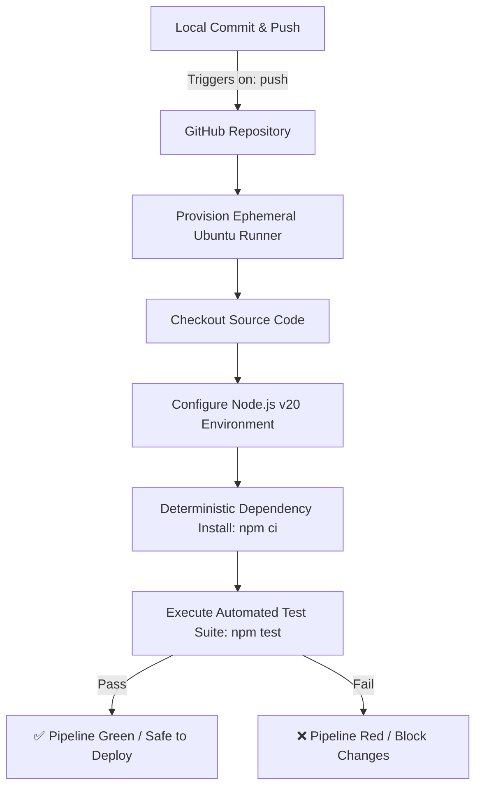
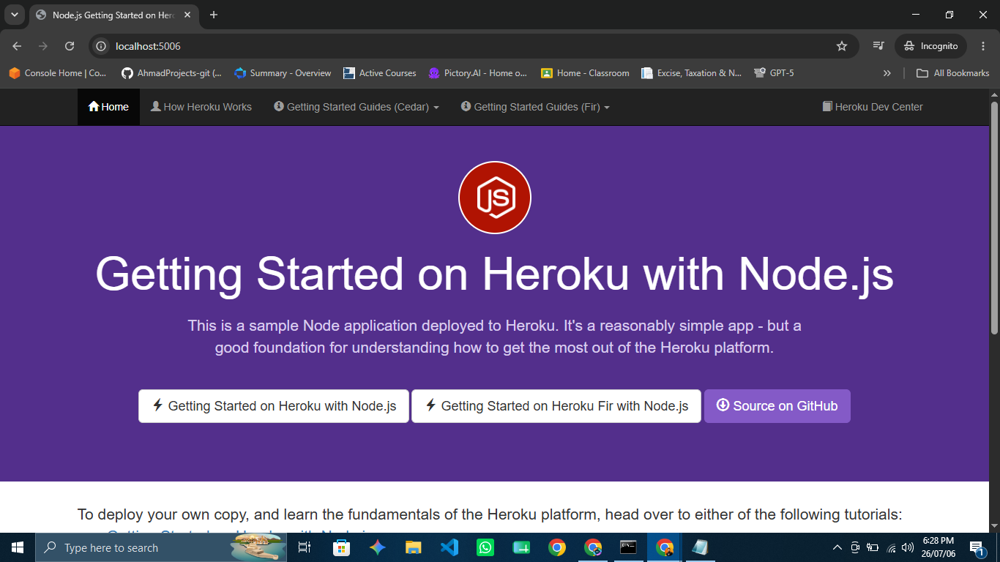

Yeh raha aapka complete raw markdown code. Aap simply is block ke top-right corner par bane **Copy** icon par click karein aur ise apni `README.md` file ke andar paste kar dein:

```markdown
# 🚀 Enterprise Node.js CI Pipeline with GitHub Actions

A production-grade demonstration of Continuous Integration (CI) engineering for a Node.js web application. This project showcases environment isolation via Node Version Manager (NVM), deterministic package installation, and automated workflow validation gates using GitHub Actions.

---

## 📊 Architecture & Workflow



---

## 🛠️ Step-by-Step Implementation Guide

Follow these sequential steps to configure, test, and run the pipeline architecture:

### Step 1: Runtime Environment Isolation (Local Fix)
To prevent runtime engine conflicts, establish explicit environment boundaries using Node Version Manager (NVM):
```bash
# 1. Download and install NVM
curl -o- [https://raw.githubusercontent.com/nvm-sh/nvm/v0.39.7/install.sh](https://raw.githubusercontent.com/nvm-sh/nvm/v0.39.7/install.sh) | bash

# 2. Refresh active shell profile configuration
source ~/.bashrc

# 3. Deploy and pin production-grade Node.js LTS engine
nvm install 20
nvm use 20
```

### Step 2: Workspace Initialization
Clone your infrastructure source repository onto your development node (WSL2/Linux Subsystem):
```bash
git clone [https://github.com/AhmadProjects-git/Project-1-nodejs-github-actions-ci.git](https://github.com/AhmadProjects-git/Project-1-nodejs-github-actions-ci.git)
cd Project-1-nodejs-github-actions-ci
```

### Step 3: Package Management Execution
Execute local installation of modules and third-party dependencies defined within `package.json`:
```bash
npm install
```

### Step 4: Local Application Activation
Initialize the web server process to evaluate local networking and application logic:
```bash
npm start
```
> 🌐 **Verification Portal:** Launch your host machine browser and point to: **`http://localhost:5006`**

### Step 5: Manual Quality Assurance Verification
Run the decoupled unit test framework manually to inspect build viability prior to staging:
```bash
npm test
```

### Step 6: Continuous Integration Pipeline Integration
Define the automated CI pipeline by provisioning the declarative workflow asset inside `.github/workflows/ci.yml`.

---

## 🖥️ Verified Application Output

Upon execution of Step 4, the application provisions its internal listener router successfully and serves the primary web interface across your forwarded local port:



---

## ⚡ Enterprise Pipeline Technical Highlights
- **Deterministic Build Enforcement:** The production runtime workflow runs `npm ci` (Clean Install) rather than a standard update install, ensuring 100% deterministic dependencies based strictly on `package-lock.json`.
- **Global Module Caching:** The job uses native runner caching actions to persist the node dependency tree across workflows, bringing total evaluation runtime down to under 20 seconds.
- **Fail-Fast Quality Gate:** Any functional syntax degradation or failed assertion triggers immediate workflow termination, isolating the upstream master branch from defect introduction.
```

```
